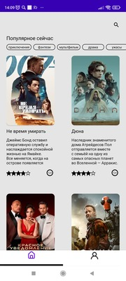

## Проект школы мобильной разработки МТС.

###### Приложение показывает список популярных фильмов полученный с сайта https://www.themoviedb.org/. Отображается афиша, описание, возрастные ограничения и рейтинг, в деталях фильма   добавляется список актеров. Данные обновляются раз в сутки в фоновом режиме.
---
### Используется:
* Архитектура MVVM
* ROOM
* Navigation component
* Retrofit + Okhttp
* Coroutines
* WorkManager

